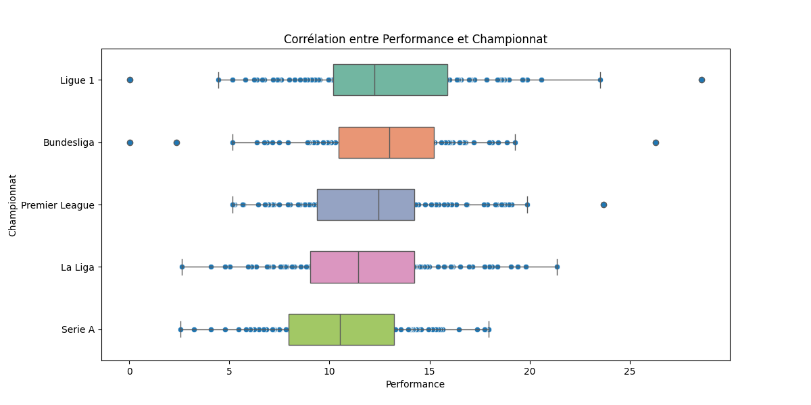

# DMB
## TP Projet : analyse des statistiques des attaquants sur le début de saison 2022-2023

Pour ce projet, nous nous sommes basé sur un jeu de donnée regroupant les statistiques des joueurs de football des 5 grands championnats Européen (Angleterre, Espagne, Allemagne, Italie et France) sur le début de saison 2022 - 2023. 

[Lien vers le jeu de données](https://www.kaggle.com/datasets/vivovinco/20222023-football-player-stats/data)

En utilisant ce jeu de données, nous allons répondre à 3 questions (facile, moyenne et difficile) sur les performances des attaquants.

#### 1ère question : Qui est le meilleur buteur des 5 grands championnats ? (Question facile)

Pour répondre à cette première question, nous avons du importer le fichier csv en utilisant spark. Nous trions ensuite la liste par ordre decroissant par rapport à la colonne Goals (nombre de but).
On affiche ensuite le nom, le nombre de but marqué, le club, le poste et la nationalité des 10 premiers joueurs de la liste.

Nous trouvons donc le résultat suivant : 

#### 2ème question : Qui est l'attaquant le plus efficace des 5 grands championnats ? (Question moyenne)

La réponse à cette question est plus compliqué car il est plus dur de définir l'efficacité d'un attaquant. Est-ce celui qui marque le plus ? Ou alors celui qui marque un but dès qu'il tire ? 

Pour répondre à la question, nous avons fusionné plusieurs statistiques pour créer un nouvel indice de performance.

Plus précisément, on commence par filtrer les joueurs pour ne garder que les attaquants qui ont joué un certain nombre de minutes (ici 1200 minutes correspondant à plus de 13 matchs environs).
On crée ensuite une map de poids correspondant aux différentes statistiques que nous allons utilisé. Cette map nous permettra de réduire l'importance de certaine statistique par rapport à d'autres.
On choisit de retenir comme statistiques le nombre de but marqué, le nombre de passe décisive (passe amenant à un but marqué), le pourcentage de tir cadré et le nombre de pénalty marqué.

On normalise donc les poids, puis on calcule une somme pondéré de la nouvelle statistique pour chaque joueur que nous appelons AttackingPerformance. Nous ajoutons ensuite cette colonne au jeu de données et nous affichons les dix meilleurs attaquants selon cette valeur : 

#### 3ème question : Est-ce que l'âge et le championnat affectent l'efficacité d'un attaquant ? (Question difficile)

L'enjeu de cette question est cette fois ce savoir si l'âge et le championnat peuvent affecter l'efficacité d'un attaquant

Pour répondre à cette question, nous devons reprendre l'indice calculé précédemment. Cependant on essaye d'être plus large sur le temps de jeu des joueurs comme nous n'avons pas besoin de chercher les meilleurs joueurs mais simplement de voir l'impact de l'âge et du championnat sur la performance.
Nous changeons donc par paramètre le temps de jeu minimum à 500 minutes (un peu plus de 5 matchs).
On commence ensuite par regarder l'impact de l'âge en traçant un graphique de la performance selon l'âge des joueurs. L'âge des joueurs est amené via un calcul par rapport à leur année de naissance. Le graphique est réalisé en transformant le jeu Spark en jeu Pandas puis en utilisant Matplotlib.

On obtient donc le résultat suivant : 

On peut constater une légère hausse des performances au fil du temps, sûrement du à l'expérience des joueurs. Cependant, on peut également voir qu'il y a une grande diversité des valeurs parmis les résultats au fil des âges. 

Pour la seconde partie de la question sur l'impact du championnat, on récupère de la même façon l'indice de performance en réduisant le montant de temps de jeu minimum à 500 minutes.
On utilise cette fois un scatterplot de la bibliothèque Seaborn à partir des résultats transformé en valeur pandas pour afficher les données. On ajoute également une boîte à moustache pour pouvoir tirer plus de conclusion.

On peut constater plusieurs résultats intéressants : 
La Ligue 1 (championnat français) possède des valeurs très distantes comme le montre la taille de la boîte à moustache très large, avec cependant une médiane assez basse. On a donc des attaquants très peu efficace avec malgré un tout un grand nombre d'attaquants performant (3ème quartile très éloigné).
A l'inverse, la Bundesliga (championnat allemand) possède un niveau très homogène avec une boîte à moustache très resserrée et une médiane au milieu de la boîte à moustache.
De plus, on peut voir qur la Premier League et la Liga (championnat anglais et espagnol) possède un niveau global assez proche avec une boîte à moustache de la même taille, avec une médiane un peu plus haute pour la Première League.
Enfin, on peut voir que la Serie A (championnat italien) possède un niveau plus bas avec la boîte à moustache la plus basse. C'est également le seul championnat avec la Liga à ne pas avoir de joueur surperformant.

On peut donc conclure que les championnats peuvent avoir une incidence sur le niveau de jeu des attaquants. On peut prendre l'exemple de la Serie A où les attaquants sont le moins performants, peut être à un jeu beaucoup plus défensif en Italie.